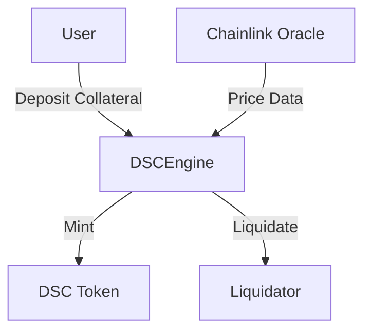

# Decentralized Stablecoin System

A decentralized, algorithmic stablecoin system built on Ethereum that maintains a 1:1 peg with USD through crypto collateralization.

## Overview

This project implements a stablecoin system with the following characteristics:

- **Decentralized**: No central authority controls the system
- **Algorithmic**: Maintains peg through programmatic incentives
- **Collateralized**: Backed by crypto assets (WETH and WBTC)
- **Stable**: Pegged 1:1 with USD
- **Liquidation Protected**: Automatic liquidations maintain system solvency

## Key Features

- 🏦 **Multi-Collateral**: Accept both WETH and WBTC as collateral
- 💱 **Chainlink Price Feeds**: Real-time price data for accurate collateral valuation
- 🔐 **Overcollateralization**: Minimum 150% collateralization ratio
- 📊 **Liquidation System**: Automatic liquidations below health factor
- ⚡ **Gas Optimized**: Efficient implementation for lower transaction costs

## System Architecture



## Core Contracts

- `DSCEngine.sol`: Main protocol logic and collateral management
- `DecentralizedStableCoin.sol`: ERC20 stablecoin implementation
- `MockV3Aggregator.sol`: Price feed mock for testing

## Testing

Comprehensive test suite including:

```bash
# Run all tests
forge test

# Run specific test
forge test --match-test testFunctionName

# Run with verbosity
forge test -vvv
```

## Security

- Rigorous testing with 100% coverage
- Formal verification of critical functions
- Comprehensive invariant testing

## Local Development

1. Clone the repository

```bash
git clone https://github.com/bluntbrain/stable-coin-foundry
cd dsc-protocol
```

2. Install dependencies

```bash
forge install
```

3. Build contracts

```bash
forge build
```

## License

This project is licensed under the MIT License - see the [LICENSE](LICENSE) file for details.
